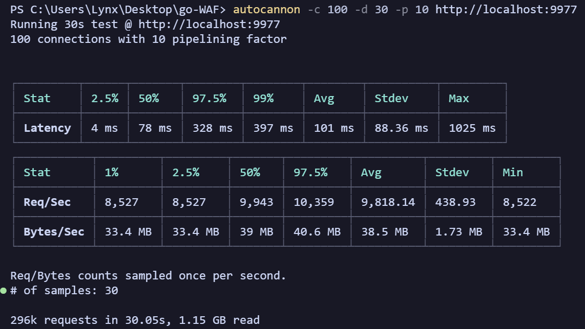
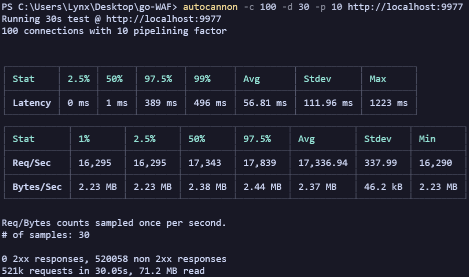
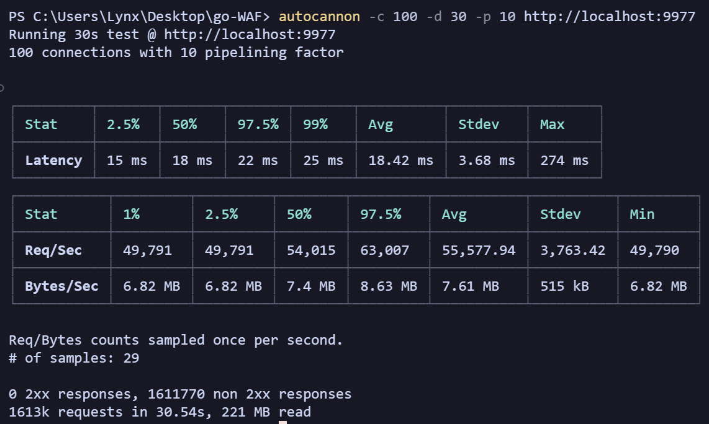

# Anti-Bot Reverse Proxy


One of my first projects in Go: A reverse proxy server that detects bots and automated browsers. Inspired by *Cloudflare*, [*Anubis*](https://github.com/TecharoHQ/anubis) and - to some extent - by the [*GrimAC* anti-cheat plugin](https://github.com/GrimAnticheat/Grim).

With LLM scrapers gaining popularity, bot mitigation is more important than ever. This experimental project aims to provide a high-performance, scalable and easy-to-use solution for bot detection and mitigation. 🔥

I rewrote the server several times to ensure excellent performance under high concurrency. On my Windows 11 & Ryzen 5 5600X PC, the server can handle over **100,000 requests per second** with an average latency of **0.5 ms**.

## Key Principles

- Lightning fast, **automated bot/spam detection** (JavaScript-based)
- Extensively **configurable options**
- Designed to prevent even automated browsers with additional bot detection protections like `playwright_stealth` and `undetected-chromedriver`
- Written in Go to ensure **high performance and scalability**
- Tested on various browsers and platforms, see below
  - Niche browsers like *Mullvad* are tested as well, since privacy-focused browsers sometimes break websites

## Installation

***Not available since the project is still in development.***

Requirements:

- Go and its dependencies
- For testing: Python 3, Playwright and other packages (depending on the test)

A basic testing environment can be launched like so:

- `pip install -r testing/requirements.txt`
- `py testing/_server.py`
- `go run .`

To make sure that automated browsers like *Playwright Stealth* are recognized as such, try `py testing/pw_stealth.py`

### High Performance Build

```bash
go build -trimpath -ldflags="-s -w" -o _built_server.exe main.go
./_built_server.exe
```

## Implemented Features

Unless otherwise noted, all configuration options formatted `like_so` can be changed in the `config.json` file.

- JavaScript-based detection of automated browsers
  - Naturally, no requests are sent to the origin server until the client has been verified
- Image CAPTCHA
- Origin server is checked before startup

### Planned

- ♻️ Automated compatibility tests for browsers (to ensure no common browser is accidently detected as a bot etc.)
- ⚠️ Ensure that forms (+ cookie-setting web pages) work correctly, even when the bot protection is triggered
- Webkit testing
- Microsoft Edge testing
- iOS/MacOS testing
- Monitor input fields & scrolling
- Various checks for `playwright_stealth` and `undetected-chromedriver`
- VPN/Proxy/datacenter/TOR detection
  - Planned using ASN and IP databases
- SSL(?)
- Caching
- Ratelimits
- Timeout handling, also needs testing
- Proper logging
- Custom error pages
- Custom filters
- Anti-DDoS
- SEO-friendiness (dummy pages for search engines)
- Load balancing
- Admin UI

## Protection

The goal is to detect all of the following methods, especially automated browsers with additional bot detection protection.

- **PW** - [Playwright](https://playwright.dev/python/) (regular)
- **UCD** - [ultrafunkamsterdam/undetected-chromedriver](https://github.com/ultrafunkamsterdam/undetected-chromedriver)
- **PWS** - [AtuboDad/playwright_stealth](https://github.com/AtuboDad/playwright_stealth)
- **TFP** - [tinyfish-io/tf-playwright-stealth](https://github.com/tinyfish-io/tf-playwright-stealth) (fork of `playwright_stealth`)
- Planned: [VeNoMouS/cloudscraper](https://github.com/VeNoMouS/cloudscraper)

*Detected:* If the bot protection flags a client as a bot.
Unless otherwise noted, **headful** mode is used, since headless mode can be detected easier.

### Regular browsers

| Client                     | Detected? | Note             |
| -------------------------- | --------- | ---------------- |
| Simple `curl` request etc. | ✅         | JS is required   |
| PW: Chrome                 | ✅         | As of 2025-03-21 |

### Browsers with evasion techniques

| Client       | Detected? | Note                                                                                                |
| ------------ | --------- | --------------------------------------------------------------------------------------------------- |
| PWS: Chrome  | ✅         | Fails [`navigator.webdriver`](https://developer.mozilla.org/en-US/docs/Web/API/Navigator/webdriver) |
| PWS: Firefox | ✅         | Fails [`navigator.userAgent`](https://caniuse.com/?search=navigator.userAgent)                      |
| PWS: WebKit  | ✅         | Fails [`navigator.userAgent`](https://caniuse.com/?search=navigator.userAgent)                      |
| TFP: Chrome  | ✅         | Fails [`window.devicePixelRatio`](https://caniuse.com/?search=window.devicePixelRatio)              |
| TFP: Firefox | ✅         | Fails [`navigator.webdriver`](https://developer.mozilla.org/en-US/docs/Web/API/Navigator/webdriver) |
| TFP: Webkit  | ✅         | Fails [`navigator.webdriver`](https://developer.mozilla.org/en-US/docs/Web/API/Navigator/webdriver) |
| UCD          | ❌         | As of 2025-03-21                                                                                    |

⚠️ **Note:** The auomated browsers with evasion techniques fail the very simple check `navigator.webdriver` unexpectedly. More testing is needed to ensure that I set up the testing environment correctly. Otherwise, this could mean that PWS and TFP only focus on specific platforms or that the evasion techniques are not working as intended.

## Browser Compatibility

It's really important to ensure that the bot protection doesn't break the website for legitimate users, even on older browsers. Please note that it's incredibly intricate to get the balance between security and compatibility right and that testing several browsers and their older versions takes a lot of time.

### Windows 11

| Browser                | Passing? | Note             |
| ---------------------- | -------- | ---------------- |
| Chrome 134             | ✅        | As of 2025-03-21 |
| Firefox 136            | ✅        | As of 2025-03-21 |
| Brave 1.76.80 (C 134)  | ✅        | As of 2025-03-21 |
| ungoogled-chromium 123 | ✅        | As of 2025-03-21 |
| LibreWolf 136          | ✅        | As of 2025-03-21 |
| Mullvad 14.0.7 (F 128) | ✅        | As of 2025-03-21 |
| Zen 1.10b (F 136)      | ✅        | As of 2025-03-21 |

### Android 14

| Browser                | Passing? | Note             |
| ---------------------- | -------- | ---------------- |
| Chrome 126             | ✅        | As of 2025-03-21 |
| Brave 1.75.181 (C 133) | ✅        | As of 2025-03-21 |
| Firefox 135            | ✅        | As of 2025-03-21 |

### Current Versions of Browsers

<!-- markdownlint-disable -->
<table>
  <tr>
    <th>Engine</th>
    <th>Browser</th>
    <th>Platform</th>
    <th>Version</th>
  </tr>
  <tr>
    <td>Chromium</td>
    <td>Chromium</td>
    <td>Desktop</td>
    <td>
  </tr>
  <tr>
    <td>Chromium</td>
    <td>Ungoogled Chromium</td>
    <td>Desktop</td>
    <td>
  </tr>
  <tr>
    <td>Chromium</td>
    <td>Brave</td>
    <td>All</td>
    <td>
  </tr>
  <tr>
    <td>Gecko</td>
    <td>LibreWolf</td>
    <td>Desktop</td>
    <td>
  </tr>
  <tr>
    <td>Gecko</td>
    <td>Mullvad</td>
    <td>Desktop</td>
    <td>
  </tr>
  <tr>
    <td>Gecko</td>
    <td>Zen</td>
    <td>Desktop</td>
    <td>
  </tr>
</table>
<!-- markdownlint-enable -->

## Benchmark

Stress test performance results, unless otherwise noted, are from my PC:

- Windows 11
- Ryzen 5 5600X

```bash
autocannon -c 100 -d 30 -p 10 http://localhost:9977
```

### Before any rewrites



### Fiber rewrite (~2x faster)



### Database rewrite (~3x faster)



Running:

```bash
.\hey_windows_amd64.exe -n 1000 -z 5s http://localhost:9977
```

...returns:

```txt
Summary:
  Total:        5.0007 secs
  Slowest:      0.3196 secs
  Fastest:      0.0001 secs
  Average:      0.0005 secs
  Requests/sec: 105054.6273

  Total data:   6829446 bytes
  Size/request: 13 bytes
```

...With similar results for `-n 50000`.

***

Developement of this project started 2025-03-20.
